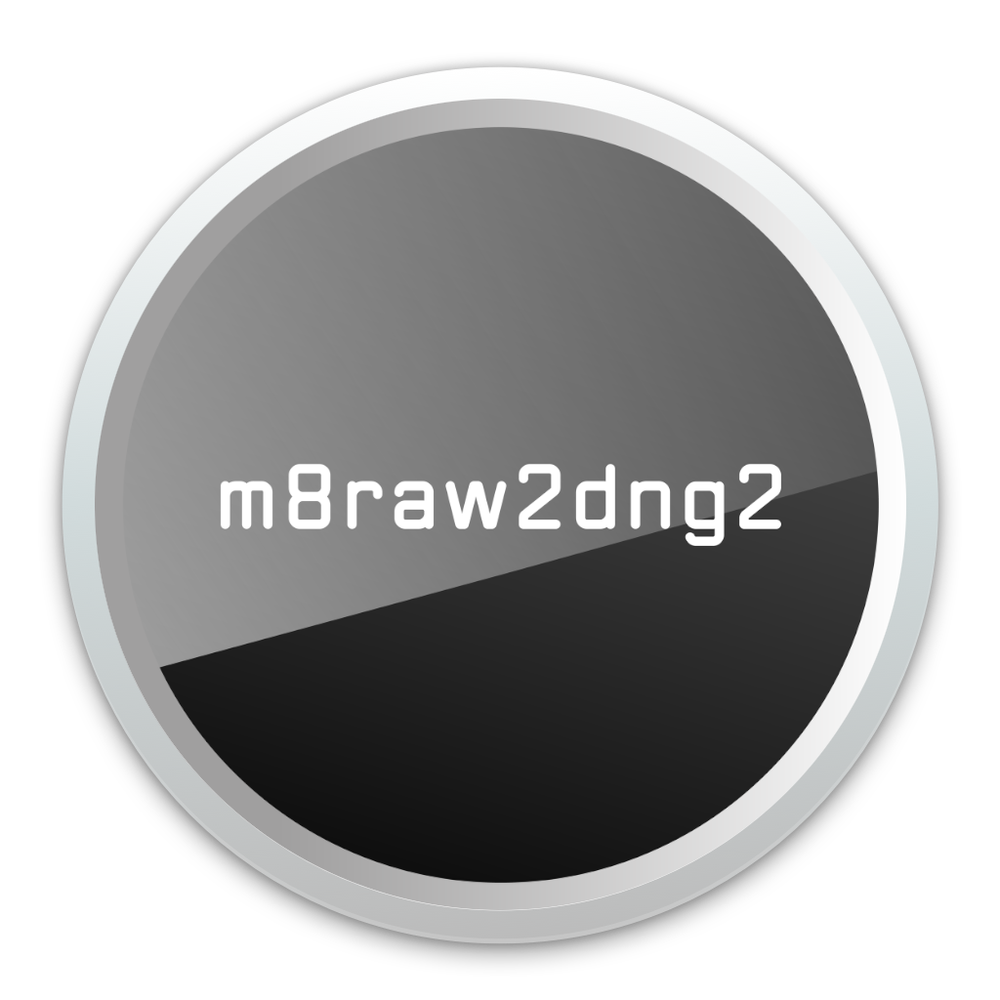

<p align="center"></p>

# m8raw2dng2

Convert the Leica M8's uncompressed diagnostic-mode RAW into Adobe DNG.

A clean-room, cross-platform (pure-Python) reimplementation of Arvid Kuehl's
`m8raw2dng` v1.2beta - byte-faithful to its output, with optional refinements.

See the [Wiki](https://github.com/botrx555/m8raw2dng2/wiki) for full documentation.

---

## What it is

The Leica M8 can emit an **undocumented uncompressed 14-bit sensor dump** (a
`.RAW`, written with a companion `.JPG`) through a hidden diagnostic mode. That
file is **not** a DNG and no mainstream raw software reads it - Lightroom, ACR,
the Adobe DNG Converter, LibRaw/dcraw, RawTherapee and darktable all reject it.
`m8raw2dng2` wraps the dump into a valid linear-CFA DNG those editors open as an
ordinary raw, preserving the full 14 bits the camera's in-built 8-bit DNG
discards.

> The M8's *normal* 8-bit DNG is already supported everywhere. This tool is **only**
> for the uncompressed diagnostic RAW.

The 14-bit dump carries 64× finer tonal quantisation than the in-camera 8-bit DNG
(16384 vs 256 levels per channel), so heavy shadow lifts and contrast moves band
far less.

Per frame it:

1. pairs the `.RAW` with its `.JPG` and reads EXIF + Leica MakerNote (body serial,
   exposure, ISO, focal length, light meters) from the JPEG;
2. decodes the dump to the raw CFA mosaic - **no demosaic**;
3. optionally subtracts a per-column darkfield and repairs defect columns (`-s`);
4. writes a hand-built little-endian DNG (single uncompressed 16-bit linear-CFA
   strip, Leica colour matrices, crop/focal-plane tags, EXIF sub-IFD, MakerNote
   copied verbatim);
5. fills `FNumber` for an un-coded lens from the meters (or an exact `-A`);
6. optionally embeds the full-resolution JPEG as the preview (`-p`).

---

## m8raw2dng2 vs m8raw2dng

The original is the reference this tool is measured against - the goal is parity
plus a few refinements, not replacement.

| | m8raw2dng (Arvid Kuehl) | m8raw2dng2 |
|---|---|---|
| Platform | Windows `.exe` + `.bat`; separate macOS droplet | Pure Python (Windows/macOS/Linux) + standalone Mac/Windows builds |
| Interface | console | same CLI **+** optional Tk GUI |
| Source | closed-source freeware | open source (MIT) |
| RAW → DNG output | the reference | byte-identical (except the estimated `FNumber`; `-A` → bit-identical) |
| `FNumber`, un-coded lens | estimated from image brightness | recovered from the camera meters, or exact via `-A` |
| Darkfield (`-sd`) | single frame | averages a folder; auto-skips long exposures |
| Defect columns | none | optional detection (`--auto-lines`) + interpolation |
| High-ISO darkfield | gain-scaled | reproduced (gain-scaled `LevelCorrection` **and** `BlackLevel`) |
| `.BIA` bias subtraction | only with `-b` | automatic whenever a `.BIA` is present |
| JPEG preview (`-p`) | thumbnail | full-resolution; optional standard-DNG layout (`--legacy-preview`) |
| DNG writer | - | built-in little-endian TIFF writer (no library needed to write) |

---

## Refinements

Parity with the original is the baseline; these are the deliberate improvements on
top of it - each opt-in or automatic:

* **Exact aperture in EXIF.** The original guesses `FNumber` from image brightness;
  `m8raw2dng2` recovers it from the camera's two light meters (after a one-time
  `--calibrate-fnumber`) or takes an exact value from `-A`.
* **Folder-averaged darkfield.** `-sd` averages a whole folder of dark frames
  (auto-skipping long exposures) rather than trusting a single frame.
* **Automatic defect-column detection.** `--auto-lines` finds and records stuck
  columns; `-s` interpolates them away. The original has no equivalent.
* **High-ISO darkfield scaling.** Darkfield and `BlackLevel` track the M8's
  whole-stop analog gain across ISO 160-2500.
* **Automatic `.BIA`.** A matching bias frame is subtracted with no extra flag.
* **Full-resolution preview.** `-p` embeds the camera's own full JPEG (the original
  writes a 320×240 thumbnail); `--legacy-preview` restores the standard layout.
* **Cross-platform + GUI.** Pure Python on Windows/macOS/Linux, with an optional Tk
  interface and click-to-run launchers.

Each is detailed below; plain `-v` / `-s` conversions stay byte-for-byte the
original's.

---

## Camera setup - recording the RAW

The uncompressed RAW is produced through the M8's service mode. From a
powered-on camera press **4× right**, **3× left**, **1× right**, then **SET**.
The compression menu then gains an extra **JPG fine + RAW** option at the bottom
of the list - select it.

* The setting is **not persistent**: any power-off (manual or auto power-save)
  reverts to JPG-only, so disable auto power-down and re-check after a power cycle.
* Each shot then writes a `.RAW` (the sensor dump) and a `.JPG` (the metadata
  source); slow exposures additionally write a `.BIA` bias frame. Keep them
  together - the same stem identifies a set.
* Service mode also exposes camera diagnostics via the **INFO** key; leave those
  alone unless you know what you are doing.

> Service mode is undocumented; you enter it at your own risk.

---

## Usage

Both front-ends read `lensdb.ini` / `sensdb.ini` from the tool's own folder.

```
python3 m8raw2dng2.py [options] FILE.RAW | FOLDER ...   # CLI
python3 m8raw2dng2_gui.py                               # GUI
```

Standalone Mac (`.app`) and Windows (`.exe`) builds requiring no Python are
attached to each release. Both are unsigned. macOS: right-click -> Open -> Open;
if blocked, `xattr -dr com.apple.quarantine /path/to/m8raw2dng2.app`. Windows:
SmartScreen -> More info -> Run anyway. Once each.

### Launchers (`.bat` / `.command`)

For non-CLI use, double-click `m8raw2dng2_run.bat` (Windows) or
`m8raw2dng2_run.command` (macOS). Each wraps the converter; open it in a text
editor and set the variables near the top:

* `INPUT` - the RAW folder (or a single `.RAW` / `.DNG`)
* `OUTPUT` - leave blank to write DNGs beside the input
* `FLAGS` - the option string (default `-v -p -b -s --no-crop --cfa RGGB`); see
  [Flags](#flags) for the full list
* `PYTHON` - `python` / `python3`, or a full path if Python isn't on `PATH`

Keep the launcher beside `m8raw2dng2.py` (and your `lensdb.ini` / `sensdb.ini`), or
set `SCRIPT` to the script's full path. Copy it per recipe you use often
(e.g. `m8_convert`, `m8_darkfield`, `m8_calibrate`).

**Requirements.** Python and the modules must be installed (see
[Requirements](#requirements)). On **macOS** the first run needs the file made
runnable and cleared past Gatekeeper: `chmod +x m8raw2dng2_run.command`, then
right-click → **Open** → **Open** once; afterwards double-click works.

### Step 1 - sensor darkfield (`-sd`), once per body

Shoot several **dark frames at base ISO** (lens cap on), then:

```
python3 m8raw2dng2.py -sd FOLDER_OF_DARKS
```

The clean frames are averaged into a per-column `LevelCorrection` (long exposures
are auto-skipped and logged) and stored under your body serial in `sensdb.ini`.
Add `--auto-lines` to also detect and record defect columns as `Line` entries.
You apply this at convert time with `-s`.

### Fixing a vertical defect line (`-st` / `Line`)

A stuck pixel can darken its whole column, showing as a bright cyan or red
vertical line in the DNG (the demosaic over-compensates the missing channel).
`--auto-lines` (with `-sd`) records these automatically; to fix one by hand:

1. Read the line's start/end pixel coordinates off a converted DNG (any editor
   that shows cursor coordinates). **Add 2 px to every x and y** - the RAW carries
   a 2-px border the cropped DNG drops (`RAW 3968×2646`, `DNG 3964×2642`).
2. Add a `Line = x1 y1 x2 y2` entry under your body serial in `sensdb.ini`
   (a vertical run, so `x1 == x2`; `y2` is usually `2645`).
3. Convert with `-st` to paint the configured lines brightly and confirm the
   placement; adjust the coordinates and repeat until the test line covers the
   defect.
4. Convert with `-s` - the column is neighbour-interpolated away. Rebuild the
   darkfield (`-sd`) afterwards if you had already created one.

### Step 2 - lens aperture calibration (`--calibrate-fnumber`), once per (body, lens)

Only for **un-coded lenses**. Shoot 5-10 frames at known apertures (any subject,
any metering mode), then pass the apertures **in filename order**:

```
python3 m8raw2dng2.py --calibrate-fnumber 2.8,4,5.6,8,11 -l <6bitcode> FRAME1.RAW FRAME2.RAW ...
```

This stores the body+lens aperture-meter offset (`MeterOffset.<code>`, plus a
cross-check `ImageCalib.<code>`) in `sensdb.ini`. Afterwards every conversion
recovers the true aperture from the two light meters automatically - no `-A`
needed. With no stored offset, a deterministic per-frame estimate is used instead.

### Step 3 - convert

```
python3 m8raw2dng2.py -v -p -s -l <6bitcode> FOLDER
```

* `-s` - apply the darkfield + defect repair (set up once, then leave on)
* `-l <6bitcode>` - write lens EXIF from `lensdb.ini` and snap `FNumber` to the
  listed apertures
* `-p` - embed the full-resolution JPEG preview
* add `-A f` to force an exact aperture, `--verify` to self-check each DNG,
  `-R` to recurse, `-j N` to convert N files in parallel

**GUI:** pick the input/output folders, tick options, click **Convert**. A live
**Command** readout shows the exact equivalent command line; a progress bar tracks
the run; the **Log** opens in its own window. The `-sd` and `--calibrate-fnumber`
setups each have their own button; in the calibration row, choosing the lens code auto-fills its apertures (still editable). An **Edit lenses…** button opens a modal `lensdb.ini` editor for adding, editing and deleting lens entries (6-bit code, maker, model, focal length, apertures). Option sets save as named **Presets** (one file
each under `Presets/`), and your last-used settings are restored on the next launch.

### Per-frame dark subtraction (`.BIA`)

For long exposures the M8 also records a per-frame bias/dark - a `.BIA` file
(same raw format, same settings, taken right after the shutter closes) to cancel
hot pixels and dark current. Place it beside the `.RAW` with the same stem
(`IMG_0001.RAW` + `IMG_0001.BIA`); it is subtracted pixel-by-pixel (clamped ≥ 0)
and `BlackLevel` is written `0`.

**Refinement vs the original.** The original subtracts the `.BIA` **only when you
also pass `-b`**. `m8raw2dng2` subtracts it **automatically whenever a matching
`.BIA` is present** (no `-b` needed) and forces `BlackLevel 0`. Output is
byte-for-byte the original's when the original was run with `-b`; without `-b` the
original leaves the bias in place, so that case differs by design.

---

## Requirements

* **Python 3.8+**
* **NumPy** - required.
* **tifffile** - optional; only to re-process an existing `.DNG` back into a DNG.
  RAW → DNG needs nothing but NumPy (the DNG writer is built in).
* **Pillow** - optional; only for the `--legacy-preview` path (decoding/despeckling
  the embedded JPEG preview). EXIF/MakerNote parsing does not use it.
* **Tk** - for the GUI only; bundled with most Python installs.

### Installing Python and the modules

**Windows** - install Python from [python.org](https://www.python.org/downloads/)
and tick *Add python.exe to PATH* (Tk is included). Then:
```
py -m pip install numpy          # add: tifffile pillow  (optional extras)
```

**macOS** - install Python from [python.org](https://www.python.org/downloads/)
(Tk included), or via Homebrew `brew install python python-tk`. Then:
```
python3 -m pip install numpy     # add: tifffile pillow  (optional extras)
```

**Linux (Debian/Ubuntu)**
```
sudo apt install python3 python3-pip python3-numpy python3-tk
python3 -m pip install --user tifffile pillow      # optional extras
```

Or, from the project folder (macOS/Linux; on Windows use `py -m pip`):
```
python3 -m pip install -r requirements.txt
```

---

## Flags

### Original-compatible

| Flag | Meaning |
|---|---|
| `-i PATH` | input file or folder (default: current folder) |
| `-o DIR` | output folder (default: alongside the input) |
| `-v` | verbose |
| `-r` | overwrite existing DNGs |
| `-b [N]` | write a `BlackLevel` tag - bare `-b` uses the default **92**; raise to cure magenta shadows, lower to cure green. Omit `-b` entirely and no `BlackLevel` is written. |
| `-p` | embed the **full-resolution** camera JPEG as the DNG preview |
| `-c` | use the M9 (`"M8RAW"`) colour matrices and model name instead of the M8 ones |
| `-l [code]` | apply lens EXIF from `lensdb.ini`; optional forced 6-bit code |
| `-s` | apply sensor fixes (darkfield + line repair) from `sensdb.ini` |
| `-sd` | create/update the sensor darkfield (one frame or a whole folder) instead of converting |
| `-st` | sensor test: paint configured/auto-detected bad columns white |

### Refinements - all opt-in; bare `-v` / `-s` stay byte-exact

| Flag | Meaning |
|---|---|
| `-A`, `--aperture F` | force the EXIF `FNumber` to f/F (otherwise it is estimated) |
| `--calibrate-fnumber AP[,AP…]` | calibration mode: derive and store this (body, lens) aperture-meter offset from known-aperture frames (apertures in filename order). See Usage → Step 2. |
| `--mimic-fnumber` | estimate `FNumber` the original's (compressed) way; less accurate, base-ISO only |
| `--legacy-fnumber` | ignore **both** light meters when estimating `FNumber` (assumed-luminance image-brightness constant only). Used automatically when no Leica MakerNote is present. |
| `--selfcal` | batch self-calibration of the aperture-meter offset from the camera's own `ApproxF` over a ≥ 8-frame batch. **Off by default** - it is batch-dependent (a frame can land on a different aperture in a different batch). A stored `MeterOffset` is always preferred. |
| `--auto-lines` | with `-sd`: **also** detect/zero/record defect columns as `Line` entries (off by default → `-sd` writes the darkfield only). `-s` then neighbour-interpolates every stored `Line`. |
| `--auto-repair` | with `-s`: **also** re-detect defect columns per image. **Dark/calibration frames only** - on a lit photo it reads scene structure as "defects" and smears real columns (the tool warns past a handful). Stored `Line`s are always repaired regardless, so normal shots need only plain `-s`. |
| `-R`, `--recursive` | walk sub-folders |
| `-j`, `--jobs N` | convert N files in parallel |
| `--dry-run` | list what would happen, write nothing |
| `--probe [PATH]` | print the geometry of a RAW/DNG file - or every RAW/DNG in a folder - then exit |
| `--db-dir DIR` | folder holding `lensdb.ini` / `sensdb.ini` (default: next to the script) |
| `--cfa PHASE` | Bayer phase `RGGB` (default) / `BGGR` / `GRBG` / `GBRG` |
| `--no-crop` | mark `DefaultCrop` as the full `3968 × 2646` frame (default is `3964 × 2642`, matching the reference). Stored pixels are unchanged; opt-in, so it diverges from byte-exact by 4 bytes. |
| `--legacy-preview` | with `-p`: write the **standard in-camera M8 DNG layout** - a JPEG preview in IFD0 with the raw CFA in a SubIFD - so macOS Finder/QuickLook show the preview instead of rendering the mosaic. Raw pixels are identical either way. |
| `--preview-size N` | long edge (px) of the `--legacy-preview` image (default `1024`, 3:2) |
| `--preview-uncompressed` | embed the `--legacy-preview` image as uncompressed RGB instead of JPEG (much larger; only if a reader dislikes the JPEG) |
| `--verify` | re-read each DNG after writing and self-check its structure (geometry, strip bounds, key tags); logs `VERIFY PASS` / `VERIFY FAIL` per file |

### Advanced - defaults are correct for the M8; a normal workflow never touches these

| Flag | Meaning |
|---|---|
| `--white N` | white / ADC ceiling (default `16383`) |
| `--raw-offset N` | header samples to skip before the pixel data (default `54`) |
| `--raw-endian little\|big` | RAW byte order (default `little`) |
| `--log [FILE]` | also write the run log to a file (conversion, `--verify`, `--probe`); auto-named if `FILE` is omitted |
| `--version` | print version and exit |

---

## Examples

```
# verbose, embed previews, one folder
python3 m8raw2dng2.py -v -p FOLDER

# everyday: lens EXIF + sensor fixes + preview, recurse, self-check
python3 m8raw2dng2.py -v -p -s -l <6bitcode> -R --verify FOLDER

# byte-faithful single file with an exact aperture
python3 m8raw2dng2.py -v -s -l <6bitcode> -A 5.6 IMG_0001.RAW

# one-time: build a darkfield from a folder of dark frames (auto-picks clean ones)
python3 m8raw2dng2.py -sd FOLDER_OF_DARKS

# one-time: calibrate the aperture meter (apertures in filename order)
python3 m8raw2dng2.py --calibrate-fnumber 2.8,4,5.6,8,11 -l <6bitcode> cal/*.RAW

# standard-DNG layout so macOS Finder shows thumbnails
python3 m8raw2dng2.py -v -p --legacy-preview -s -l <6bitcode> FOLDER

# inspect geometry without converting
python3 m8raw2dng2.py --probe FOLDER
```

---

## Troubleshooting

* **Magenta cast in the shadows** - set a black level with `-b`; raise it
  (e.g. `-b 95`) if it persists.
* **Green cast in the shadows** - lower the black level (`-b 88`, etc.).
* **Bright cyan/red vertical line** absent from the camera's own DNG - a defect
  column; see *Fixing a vertical defect line*.
* **Won't open in Capture One** - drop `-c` (its M9 matrices aren't supported
  there) and keep `-p` on; some readers reject a preview-less DNG.
* **A `.RAW` won't convert** - it needs its companion `.JPG` beside it; the
  metadata (serial, exposure, lens, meters) comes from the JPEG.

---

## Databases - `lensdb.ini` & `sensdb.ini`

Two optional INI files kept next to the script (or pointed to with `--db-dir`)
hold the per-body and per-lens calibration the converter applies. Both are plain
text you can read and edit.

**`sensdb.ini`** - per-body sensor calibration; written by `-sd` and `--calibrate-fnumber`, read by `-s`. Keyed by body serial:

```
[<body-serial>]
LevelCorrection = <float>          ; one value per image column
...
Line = x1 y1 x2 y2                 ; a defect-column run, repaired by -s
MeterOffset.<6bitcode> = <float>   ; aperture-meter offset (--calibrate-fnumber)
ImageCalib.<6bitcode>  = <float>   ; meter<->image cross-check constant
```

A `Line` may also be written as four consecutive `Line =` entries (`x1`, `y1`,
`x2`, `y2`) - the original's format - which this tool reads as well, so existing
`sensdb.ini` files load unchanged.

**`lensdb.ini`** - per-lens EXIF, authored by hand and read by `-l`. Keyed by 6-bit lens code:

```
[<6bitcode>]
Maker = <maker>
Model = <model>
SerialNo = <serial>
FocalLength = <mm>
Aperture = 2.0
Aperture = 2.4
...
```

`-l <code>` fills `LensMake` / `LensModel` / `LensSerialNumber`, the focal length
and its 35 mm equivalent (× 1.33 M8 crop) and the APEX maximum aperture, and snaps
the estimated `FNumber` to the listed apertures.

The 6-bit code is the bit pattern on the lens bayonet read from behind
(black = 1, white = 0); `000000` is un-coded. The M8 only records a code when the
frame-line lever matches the mounted lens, so for an un-coded or mis-levered lens
force the code you want with `-l <6bitcode>`.

---

## Format & internals

**RAW dump.** `21,049,052` bytes: `54` leading 16-bit samples, then `2646` rows ×
`3976` samples (only the first `3968` per row are image data; the rest discarded),
then one ignored trailing stride-row. Little-endian; values clamped to `16383`
(14-bit). The decode yields the raw CFA mosaic - one 14-bit value per photosite,
no rendering applied.

**DNG.** Hand-built little-endian TIFF (no library needed to write): IFD0 (47 tags)
→ EXIF sub-IFD (21 tags) → MakerNote (copied verbatim) → Leica M8 colour matrices
(Standard-A + D65) → a single **uncompressed** strip of 16-bit linear CFA samples.
`WhiteLevel` `16383`; CFA phase from `--cfa`; default `DefaultCropOrigin (2,2)` /
`DefaultCropSize 3964 × 2642` (full `3968 × 2646` with `--no-crop`). `BlackLevel`
is written only with `-b`. Default `-p` keeps the raw in IFD0 (byte-identical to
the original); `--legacy-preview` puts a JPEG preview in IFD0 and the raw in a
SubIFD.

**Black level (`-b`).** A raw developer derives white balance from the black
point, and the M8's green channel sits slightly above red/blue: too low a black
level tints shadows green, too high tints them magenta. Bare `-b` writes the
reference's `92`; nudge per body/taste. With no `-b`, no `BlackLevel` tag is
written and the developer assumes `0`.

**FNumber (un-coded lens).** The M8 records no aperture. Default: a deterministic
per-frame estimate anchored on `ExternalSensorBrightnessValue`. With a stored
`MeterOffset` (`--calibrate-fnumber`): the aperture is recovered from
`MeasuredLV - ExternalSensorBrightnessValue + offset` and snapped to the lens's
half-stop grid; if `ImageCalib` is also stored, a meter↔image cross-check runs to
catch a corrupt meter reading. `-A` overrides everything;
`--mimic`/`--legacy`/`--selfcal` select alternative estimators.

**Flat-field (`-s`).** Per column, `LevelCorrection[c] = max(0, column_mean[c] - T)`
with `T = 0.8406 × mean(column_mean)` (calibrated to the ISO-160 reference);
stored `Line` columns are neighbour-interpolated. High ISO: both `LevelCorrection`
and the written `BlackLevel` are scaled by whole-stop analog gain
(`2^round(log2(ISO/160))` → 1/2/4/8/16 across the M8's 160-2500 steps).

**Fidelity vs the original.**

* `-v` (no `-A`) - **byte-identical** except the 3 bytes of the estimated
  `FNumber`. Full 21 MB CFA strip, all 47 IFD0 + 21 EXIF tags and the verbatim
  MakerNote match exactly.
* `-v -A f` - **100 % byte-identical** (zero differing bytes).
* `-l` (coded-lens aperture) - byte-identical, including lens EXIF.
* `-b` - pixels byte-identical (the CFA is never edited); adds a `BlackLevel`
  tag the original omits.
* `.BIA` dark subtraction - a by-design divergence: subtracts the dark frame and
  writes `BlackLevel=0` (the original ignores an adjacent `.BIA`).
* `-s` - **near-exact (±1 DN).** The original's per-frame pedestal (~0.26 DN,
  drifting frame-to-frame) and per-pixel floor/ceil dither are not recoverable
  from the stored darkfield; high-ISO gain scaling is reproduced and `BlackLevel`
  is byte-exact.

---

## Faithful by construction

Because Arvid's tool is closed-source, this is a **clean-room** reimplementation:
written from observed input/output behaviour, never from his code. The DNG is
emitted by a small purpose-built little-endian TIFF/DNG writer (not a generic
library) so the bytes line up, and the output was byte-diffed against real
reference DNGs from the original until everything matched except the one field the
original only *estimates* (`FNumber`). Plain `-v` / `-s` output is byte-for-byte
the original's; every refinement is opt-in.

---

## Version history

`m8raw2dng2` reproduces the behaviour of Arvid Kuehl's `m8raw2dng` **v1.2beta** (its
last public release) and adds the refinements noted above. Versioned independently;
see the Git tags / release notes for full per-version detail.

* **2.13.1 beta** (`2.13.1b0`) - corrected attribution (Arvid Kuehl) and
  `-b`/`.BIA`/`BlackLevel` fidelity wording; no behaviour change.
* **2.13.0 beta** (`2.13.0b0`) - standalone Mac/Windows builds (no Python needed);
  GUI lens-database editor.
* **2.12.0 beta** (`2.12.0b0`) - first public release.

---

## Credits, attribution & license

This tool is an independent, clean-room reimplementation in Python of the original
**m8raw2dng** by **Arvid Kuehl** (m8raw2dng.de), who discovered how to unlock the
Leica M8's uncompressed RAW mode and wrote the first converter for it. The
original is closed-source freeware; this project was written from scratch by
observing input/output behaviour and was **not** derived from or based on Arvid's
source code. All gratitude to Arvid for the original discovery and tool. The uncompressed-RAW mode was first surfaced on the Leica User Forum by *romanvail*; the aperture-estimation lineage for un-coded lenses traces to *Sandy McGuffog*'s formula (as used by the original). Credit to both.

This project is **not affiliated with, authorized, or endorsed by** Arvid Kuehl or
Leica Camera AG. "Leica" and "M8" are trademarks of Leica Camera AG, and "DNG" is
a format defined by Adobe; all are used here only nominatively, to describe
compatibility.

Licensed under the **MIT License** - see [LICENSE](LICENSE). The MIT license
covers this reimplementation's own source code only.
